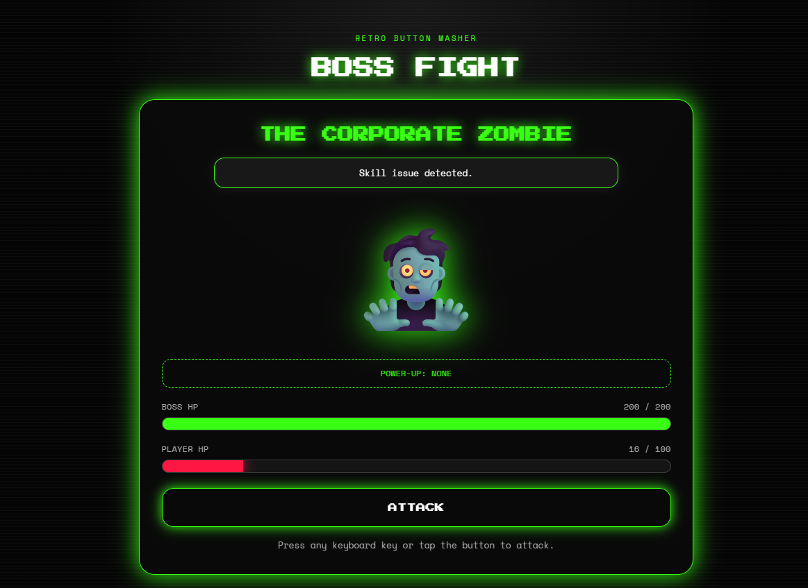

# Boss Fight Button Masher

A fast retro browser game where the player taps, clicks, or presses keys to defeat a sequence of escalating arcade bosses.

Boss Fight Button Masher is built with HTML, CSS, and vanilla JavaScript. It focuses on simple game state, timed boss attacks, health bars, temporary power-ups, animated feedback, and responsive controls that work on desktop and mobile.

## Live Demo

https://fazal305.github.io/boss-fight-button-masher/

## Preview



## Features

- Keyboard and button-based attack controls
- Five escalating boss fights
- Player HP and boss HP systems
- Timed boss attacks
- Random attack names and boss dialogue
- Temporary power-ups for double damage, healing, and critical hits
- Floating damage numbers
- Screen shake and boss hit animations
- Victory, retry, and final win screens
- Best-run tracking with `localStorage`
- Retro sound effects with safe Web Audio fallback
- Responsive layout for desktop and mobile
- Reduced-motion support

## Boss Lineup

| Boss                          | Difficulty  |
| ----------------------------- | ----------- |
| Deadline Overlord             | Easy        |
| Exam Season                   | Medium      |
| Ancient WiFi Router           | Medium-Hard |
| The Algorithm                 | Hard        |
| Final Boss: Sleep Deprivation | Insane      |

## Controls

| Action        | Control                      |
| ------------- | ---------------------------- |
| Attack        | Press any keyboard key       |
| Mobile attack | Tap the Attack button        |
| Next boss     | Use the result screen button |
| Retry fight   | Use the result screen button |

## Power-Ups

| Power-Up      | Effect                                      |
| ------------- | ------------------------------------------- |
| Double Damage | Doubles attack damage for a short time      |
| Heal Boost    | Restores part of the player HP              |
| Crit Mode     | Gives attacks a chance to land extra damage |

## Tech Stack

- HTML5
- CSS3
- Vanilla JavaScript
- Web Audio API
- localStorage API

## Project Structure

```text
boss-fight-button-masher/
|-- index.html
|-- boss-styles.css
|-- boss-script.js
|-- image.png
|-- LICENSE
`-- README.md
```

## What I Practiced

- DOM manipulation
- Keyboard and click event handling
- Game state management
- Timer setup and cleanup
- Health bar calculations
- Randomized gameplay systems
- CSS animation feedback
- Responsive UI design
- Browser storage with `localStorage`
- Small accessibility improvements with live regions and semantic markup

## Run Locally

Open `index.html` in a browser.

No build tools, dependencies, or package installation are required.

## Author

Built by Fazal Abbas.

- GitHub: https://github.com/fazal305
- LinkedIn: https://www.linkedin.com/in/fazal-abbas-4653dg86

## License

This project is licensed under the MIT License.
